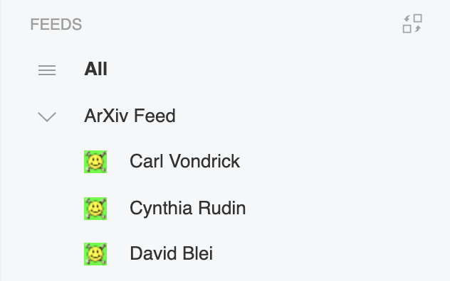

# ArXiv RSS
### Quick scripts for following the arXiv publications of authors you're interested in.

## Motivation
As researchers, we often want to keep up-to-date with the work of specific authors we're interested in. ArXiv unfortunately doesn't have a system for following authors. Google Scholar supports email alerts for new publications, but I (and I suspect many others) don't want my inbox filled with individual emails for every new paper. 

Instead, what would be ideal would be a simple feed one could scroll through automatically populated with papers from each author. This repo provides two ways to accomplish that goal, using the arXiv API.



## Method

For either method, you must create a list (saved as `authors.csv` in this directory) of the authors you'd like to follow (full names, one per line). You must also create an account on some RSS reading service. I've used [Feedly](https://feedly.com/) before, but I'm sure there are other good ones too. 

The [first method](#method-1) results in a feed with each author listed as a separate source. This is convenient in that you can scroll through each author's work separately, or unsubscribe from individuals without having to re-run any code. Unfortunately, many RSS readers restrict the number of sources you can use with a free account (for example, Feedly limits you to 100). The script for this depends on `pandas`, which I used to vectorize everything.

The [second method](#method-2) results in a feed with all authors combined into one source and has no dependencies. To remove authors, you must delete your previous source, rerun the script with the authors removed from your `.csv`, and re-upload (clearing your read history). This does have the benefit of avoiding source count restrictions.

## Usage
### Method 1
```
python multifeed.py > [your-filename-here].xml
```
Upload the resulting OPML file to your RSS reader of choice. (For Feedly, you can do so [here](https://feedly.com/i/cortex).) The authors should auto-populate as sources with appropriate titles. Most RSS readers should avoid duplicating sources, so as you add new authors to your list you can repeat the process without changes. This method requires `pandas` in your environment.


### Method 2
```
python singlefeed.py
```
Copy the resulting URL into your RSS reader. You will need to set the title of this source manually. You're done! But since it's only one source, if you modify the author list you'll need to delete everything and redo it, losing your read history. 


#### Helpful References

https://gist.github.com/myles/1051517/b3fcb86beffc37adce17e07d709ac8831ab33fc3

https://academia.stackexchange.com/questions/81831/is-there-a-way-to-follow-particular-authors-on-arxiv

